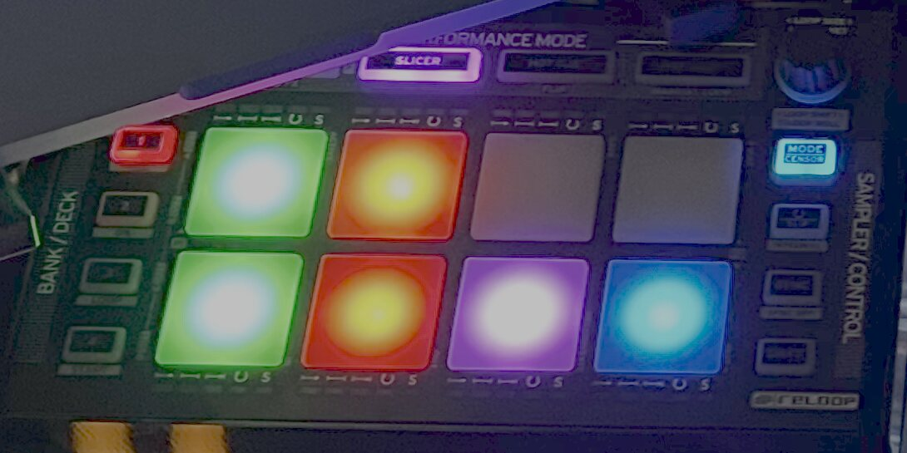

# neon-bridge

Real RGB pad colours for the **Reloop Neon** in **rekordbox**.

Map a Neon in rekordbox and the pads light up white. All of them, always. This
fixes that.

<!--  -->

---

## Why the pads are white

Two facts that are hard to find anywhere else:

**The Neon encodes pad colour in the velocity byte** as three 2-bit fields —
`velocity = (R << 4) | (G << 2) | B`, each channel 0-3, giving 64 colours.
Reloop's official MIDI map documents the buttons, the encoders and the small
status LEDs, but not this.

**rekordbox can only send velocity 127.** Not "does not by default" — cannot.
Every control type, every flag, and a hand-written three-byte output message
all produce 127; the output field is a fixed 16 bits with no room for a value.
And `127` is `0b1111111`, whose low six bits are all set, which on a Neon is
full white.

So rekordbox has been talking to the right address the whole time. It just only
knows one word.

Both claims are reproducible from the outside, with a MIDI monitor and a text
editor. The measurements are written up in
[docs/rekordbox-midi-mapping.md](docs/rekordbox-midi-mapping.md) and the full
hardware protocol in
[docs/neon-midi-protocol.md](docs/neon-midi-protocol.md).

---

## What it does

A translating virtual MIDI device sits between rekordbox and the hardware:

```
NEON ──────────► bridge ──────────► "NEON Bridge" ──► rekordbox
NEON ◄── colour ─ bridge ◄────────── "NEON Bridge" ◄── rekordbox
```

rekordbox maps to `NEON Bridge` and keeps sending 127. The bridge replaces that
with a real colour on the way to the hardware. Input passes straight through, so
MIDI learn works normally.

Colour follows the **function**, not the address. The bridge reads rekordbox's
own mapping file, so `PAD3_HotCue` is yellow and `ActivePartVocal` is green no
matter which pad bank you put them in. Remap in rekordbox and the bridge picks
it up within a couple of seconds — no restart.

Multiple Neons each get their own virtual device (`NEON Bridge`,
`NEON Bridge 2`, …) so they can be mapped separately.

---

## Setup

```sh
npm install
```

**Order matters.** rekordbox enumerates MIDI devices at launch, so the bridge
has to be running first.

```sh
./start.sh          # clears the direct NEON mapping, starts the bridge, launches rekordbox
```

Then, in rekordbox → Preferences → Controller → MIDI:

1. Select **NEON** and import a file containing only `@file,1,NEON` — this stops
   rekordbox from driving the hardware directly and painting over the bridge.
   `start.sh` does this for you.
2. Select **NEON Bridge** and map it however you like.

Or run the bridge on its own:

```sh
node neon-bridge.js --monitor
```

| Flag | |
|---|---|
| `--show` | print the colour assignment and exit, without touching MIDI |
| `--monitor` | log every message passing through |
| `--rb` | launch rekordbox once the virtual ports exist |
| `--link` | send the SysEx that enables decks 3+4 on a daisy-chained pair |

---

## Choosing colours

Colour rules live at the top of `neon-bridge.js`. First match wins:

```js
const RULES = [
  [/^PAD(\d+)_HotCue/,  m => HOTCUE[(+m[1] - 1) % 8]],
  [/^ActivePartVocal/,  () => C.GREEN],
  [/^PlayPause/,        () => C.GREEN],
  [/^Cue$/,             () => C.ORANGE],
];
```

Any of the 64 colours is available as `c(r, g, b)` with each channel 0-3. See
the [colour chart](https://sm4rtenheimerdk.github.io/neon-bridge/) for all of them.

`node neon-bridge.js --show` prints what every mapped function will get:

```
NEON Bridge — 24 pads coloured
  97 08  Slicer   pad 1   PlayPause            GREEN
  97 09  Slicer   pad 2   Cue                  ORANGE
  97 10  HotCue   pad 1   PAD1_HotCue          RED
```

A pad missing from that list has no matching rule and falls back to a palette
chosen by hardware mode.

Rules are code, so changing them needs a restart. The mapping is data and
reloads by itself.

---

## Requirements and limits

- **Node 18+**, one dependency (`@julusian/midi`).
- **macOS and Linux only.** The bridge relies on virtual MIDI ports, which
  RtMidi does not support on Windows. On Windows you would need a loopback
  driver such as loopMIDI and a small change to open those ports by name.
  Untested — reports welcome.
- Tested against **rekordbox 7** on macOS. The mapping directory is still
  named `rekordbox6`.
- **Colours are yours, not rekordbox's.** The bridge cannot know that you
  coloured hot cue 3 purple in rekordbox, because that colour never leaves the
  application over MIDI. Pad colours come from the rules in this repo.
  Reading the real cue colours would mean pulling them off the network over
  Pro DJ Link — a much larger project, and not what this is.

---

## Disclaimer

Not affiliated with, endorsed by, or connected to Reloop or AlphaTheta. Reloop
and rekordbox are trademarks of their respective owners.

This project contains no code, assets or documentation from either vendor. The
hardware protocol was determined by observing MIDI traffic to and from a device
the author owns; the rekordbox file format was determined by reading files
rekordbox writes on the author's own machine. Nothing here modifies, patches or
circumvents anything — the bridge is an ordinary virtual MIDI device, the same
category of tool as any MIDI translator.

## License

MIT — see [LICENSE](LICENSE).
